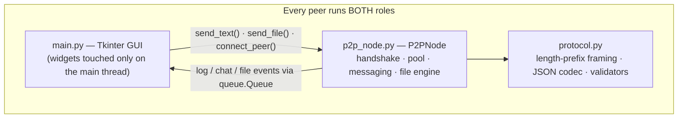

# P2P Network — Serverless Peer-to-Peer Messaging & File Sharing over TCP

**CSE 433 — Blockchain & Distributed Security Lab**  
*University of Asia Pacific*  
**Author:** `<Your Name>` — `<Student ID>`

Built with the **Python 3.9+ standard library only** (`socket`, `threading`, `json`, `struct`, `os`, `tkinter`). Zero third-party packages (`pip install -r requirements.txt` installs nothing).

---

##  Project Overview

A lightweight, serverless peer-to-peer application in which every node is simultaneously a **TCP server** (accepting inbound peers) and a **TCP client** (dialing outbound peers). 

Peers identify each other through a `HELLO` / `HELLO_ACK` handshake, exchange length-prefixed JSON text messages, and stream binary files (images, audio, video, PDFs, ZIPs) using a two-phase protocol — all built on a multi-threaded core featuring a strict security gate, graceful failure handling, and a Tkinter GUI with a color-coded event log.

> **No central server. No broker.** Any two peers that know each other's `IP:port` form a mesh.

---

##  Features

| Area | Capability |
| :--- | :--- |
| **Architecture** | Every node = TCP server and client; accept-loop thread + one reader thread per connection |
| **Framing** | 4-byte big-endian length prefix (`struct.pack('>I')`) — exact message boundaries over a raw TCP byte stream |
| **Handshake** | `HELLO`/`HELLO_ACK` identity exchange with a 5 s gate — unidentified connections never reach the message loop |
| **Connection pool** | Registry keyed by `peer_id`; one live link per peer; duplicates auto-replaced (newest wins) |
| **Messaging** | Broadcast to all peers or private messages to a selected peer; emoji/Bangla-safe UTF-8 |
| **File transfer** | Two-phase: JSON metadata $\rightarrow$ exactly `filesize` raw bytes in 64 KiB chunks; progress both directions; SHA-256-verified delivery |
| **Safety** | Filename sanitization (path-traversal defense), 10 MiB frame cap, 1 GiB transfer cap (anti-disk-fill), atomic `.part` saves + crash-recovery sweep |
| **Resilience** | Clean-FIN and hard-reset (`WinError 10054`) handling, malformed-payload rejection, hostile-connection refusal — a single connection's failure never crashes the node |
| **UI** | Tkinter GUI and an interactive CLI driver — fully interoperable with each other |

---

##  Architecture



## Code snippet
sequenceDiagram
    participant B as Bob (initiator)
    participant A as Alice (acceptor)

    B->>A: TCP connect
    B->>A: HELLO {peer_id, peer_name, port}
    A->>B: HELLO_ACK {peer_id, peer_name, port}
    Note over B,A: Both sides identified — message loop begins

    B->>A: TEXT {sender_id, sender_name, message}
    B->>A: FILE META {filename, filesize}
    B-->>A: raw bytes — exactly filesize bytes, 64 KiB chunks
    Note over B,A: Stream resynchronizes — the next frame parses cleanly

## Project Structure
P2P_Network/
├── main.py           # Tkinter GUI — thread-safe queue bridge, peers list, file dialog
├── p2p_node.py       # TCP server/client core, pool, handshake, messaging, transfer engine
├── protocol.py       # Framing, JSON codec, message builders, security validators
├── requirements.txt  # Standard library only — nothing to install
├── README.md
├── screenshots/      # Demonstration evidence
└── downloads/        # Received files (auto-created; gitignored)

## Setup
~Install Python 3.9 or newer (python --version).

~Clone this repository and open a terminal in the project folder.

~(First run on Windows may show a firewall prompt for Python; click Allow.)

## Running
```
python main.py
```

## CLI
```
python p2p_node.py --name Alice --port 5000
python p2p_node.py --name Bob   --port 5001 --connect 127.0.0.1:5000

# CLI commands: /list, /msg <peer> <text>, /file <path>, /fileto <peer> <path>, /quit
```

## Protocol Self-Test (No Networking Needed — 11 Unit Tests)
```
python protocol.py
```

## How to Connect Peers

~Start a peer: Enter a Name and a free Port (e.g., 5000), then click Start Peer. The node listens on all interfaces (0.0.0.0).
~Dial another peer: In any other window, enter the target IP (127.0.0.1 for local testing) and target port, then click Connect.
~Handshake: The HELLO handshake runs ($\le$ 5 s). On success, both peers appear in each other's Connected Peers list.

## Licence
Academic project — submitted for CSE 433, University of Asia Pacific.
